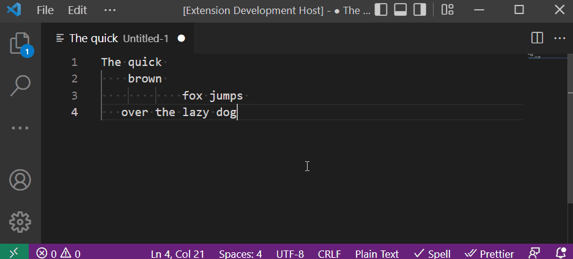

# LineBreakRemover README

## Features

There is no feature, this extenstion just removes all line breaks from the selected text in your editor and replaces them by space.

## How to use:

- Select the text you like all the break lines to be removed
- Use `Ctrl+Shift+D` or `Cmd+Shift+D` on Mac and search for command 'Remove Line Breaks'
- Press `Enter` and the text you selected will be replaced.

**Enjoy!**

M.Nikravesh
